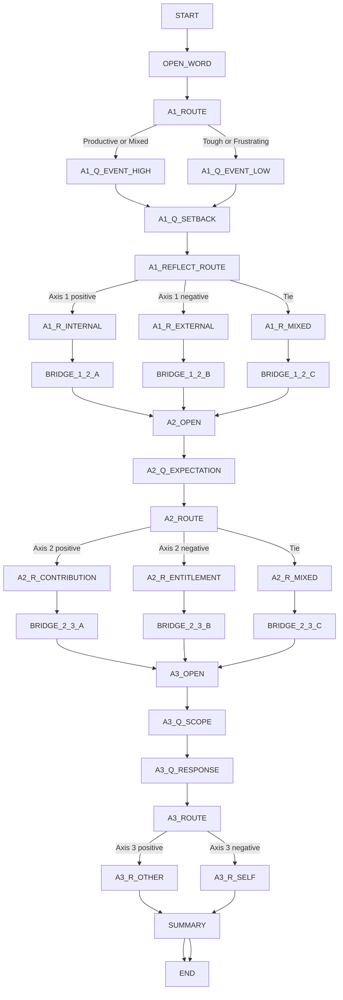

```mermaid
flowchart TD
    START --> OPEN_WORD --> A1_ROUTE
    A1_ROUTE -->|Productive or Mixed| A1_Q_EVENT_HIGH
    A1_ROUTE -->|Tough or Frustrating| A1_Q_EVENT_LOW
    A1_Q_EVENT_HIGH --> A1_Q_SETBACK
    A1_Q_EVENT_LOW --> A1_Q_SETBACK
    A1_Q_SETBACK --> A1_REFLECT_ROUTE
    A1_REFLECT_ROUTE -->|Axis 1 positive| A1_R_INTERNAL
    A1_REFLECT_ROUTE -->|Axis 1 negative| A1_R_EXTERNAL
    A1_REFLECT_ROUTE -->|Tie| A1_R_MIXED
    A1_R_INTERNAL --> BRIDGE_1_2_A --> A2_OPEN
    A1_R_EXTERNAL --> BRIDGE_1_2_B --> A2_OPEN
    A1_R_MIXED --> BRIDGE_1_2_C --> A2_OPEN
    A2_OPEN --> A2_Q_EXPECTATION --> A2_ROUTE
    A2_ROUTE -->|Axis 2 positive| A2_R_CONTRIBUTION
    A2_ROUTE -->|Axis 2 negative| A2_R_ENTITLEMENT
    A2_ROUTE -->|Tie| A2_R_MIXED
    A2_R_CONTRIBUTION --> BRIDGE_2_3_A --> A3_OPEN
    A2_R_ENTITLEMENT --> BRIDGE_2_3_B --> A3_OPEN
    A2_R_MIXED --> BRIDGE_2_3_C --> A3_OPEN
    A3_OPEN --> A3_Q_SCOPE --> A3_Q_RESPONSE --> A3_ROUTE
    A3_ROUTE -->|Axis 3 positive| A3_R_OTHER
    A3_ROUTE -->|Axis 3 negative| A3_R_SELF
    A3_R_OTHER --> SUMMARY --> END
    A3_R_SELF --> SUMMARY --> END
```
